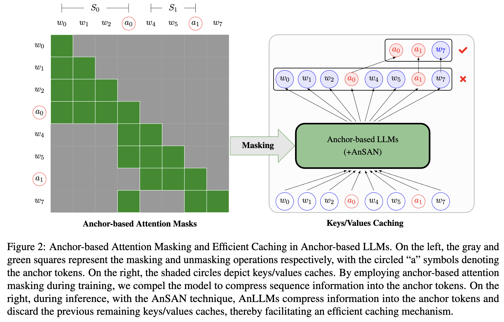
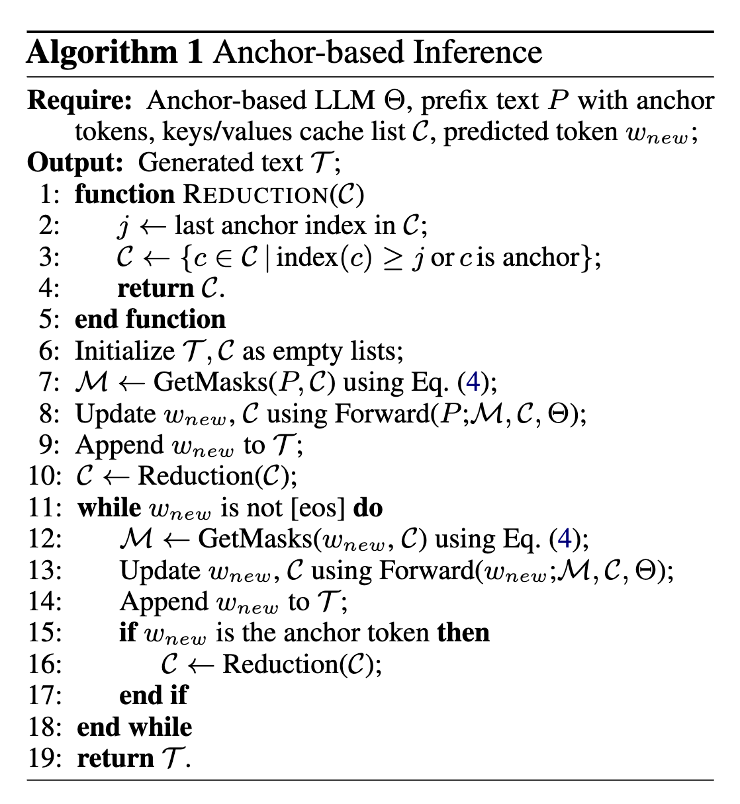

<div align="center">
    
    <h2>
    Salute the Classic: Revisiting Challenges of Machine Translation in the Age of Large Language Models <br><br>
     <a href="https://arxiv.org/abs/2402.07616">  </a>
     <!-- <a href="https://github.com/wxjiao/InstructMT">  </a>  -->
    </h2>
</div>

Large language models (LLMs) predominantly employ decoder-only transformer architectures, necessitating the retention of keys/values information for historical tokens to provide contextual information and avoid redundant computation. However, the substantial size and parameter volume of these LLMs require massive GPU memory. This memory demand increases with the length of the input text, leading to an urgent need for more efficient methods of information storage and processing. This study introduces Anchor-based LLMs (AnLLMs), which utilize an innovative anchor-based self-attention network (AnSAN) and also an anchor-based inference strategy. This approach enables LLMs to compress sequence information into an anchor token, reducing the keys/values cache and enhancing inference efficiency. Experiments on question-answering benchmarks reveal that AnLLMs maintain similar accuracy levels while achieving up to 99\% keys/values cache reduction and up to 3.5 times faster inference. Despite a minor compromise in accuracy, the substantial enhancements of AnLLMs employing the AnSAN technique in resource utilization and computational efficiency underscore their potential for practical LLM applications.

## Anchor-based Attention Masks

<p align="center">

</p>

## Anchor-based Inference

<p align="center">

</p>

## Training

### Prepare data

We use the [RedPajama-Data-1T-sample](https://huggingface.co/datasets/togethercomputer/RedPajama-Data-1T-Sample) datasets from Huggingface Repo.
For AnLLM-AC, add an new token \<AC> in the end of each sequeence. 

### Continue Pre-training

```
bash run-allm-ac.sh
```

## Inference


## Information

If you find our work to be useful and beneficial for your research, we would greatly appreciate it if you could kindly cite our paper in your references. Thank you for your support!

```
@article{pang2024anchor,
  title={Anchor-based Large Language Models},
  author={Pang, Jianhui and Ye, Fanghua and Wong, Derek F and Wang, Longyue},
  journal={arXiv preprint arXiv:2402.07616},
  year={2024}
}
```

